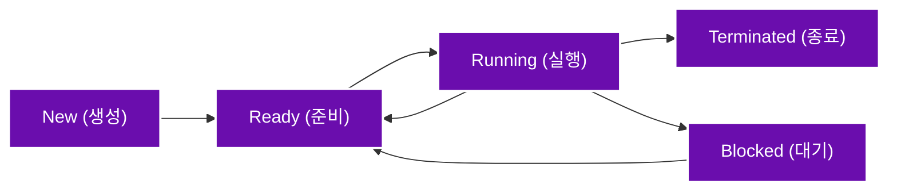

# 프로세스 개요

## 1. 프로세스의 개념
### 1.1 프로세스란?
- **프로세스(Process)** : 컴퓨터에서 실행 중인 프로그램
- **구성 요소**
  1. **코드(Code)** : 실행할 명령어 모음
  2. **메모리(Memory)** : 실행에 필요한 데이터 저장
  3. **상태(State)** : 현재 실행 중인지, 대기 중인지 등의 정보

### 1.2 프로그램과 프로세스의 차이
- **프로그램** : 실행되기 전의 정적인 파일
- **프로세스** : 실행 중인 프로그램으로, 메모리에 적재되어 동작하는 상태

### 1.3 스레드(Thread)란?
- 프로세스 내에서 동작하는 작은 실행 단위
- 같은 프로세스 내에서 **메모리를 공유**하며 여러 작업을 수행

---

## 2. 프로세스의 구조
### 2.1 프로세스를 쉽게 이해하기
- **프로세스 = 요리 과정** 🍳
  - **코드** = 레시피 📖
  - **데이터** = 요리 재료 🥕
  - **힙(Heap)** = 냉장고 (필요하면 저장하고 꺼내 씀)
  - **스택(Stack)** = 도마 (잠시 쓰고 버리는 공간)

### 2.2 프로세스의 주요 메모리 영역
1. **코드(Code) 영역** : 실행할 명령이 저장된 공간
2. **데이터(Data) 영역** : 프로그램이 사용하는 전역 변수 저장
   - **전역 변수, 정적 변수** 포함 (프로그램 시작~종료까지 유지)
3. **힙(Heap) 영역** : 실행 중에 동적으로 할당되는 메모리 저장
   - 필요할 때 만들고, 필요 없으면 삭제 가능
4. **스택(Stack) 영역** : 함수 호출 시 사용되는 임시 저장 공간
   - **지역 변수, 매개 변수 저장**
   - **후입선출(LIFO, Last-In First-Out) 방식** 사용

### 2.3 정적 할당 vs 동적 할당
| 할당 방식 | 특징 | 속도 |
|-----------|------------------|------|
| 정적 할당 | 실행 전에 미리 메모리 할당 | 빠름 |
| 동적 할당 | 실행 도중에 메모리 할당 | 상대적으로 느림 |

---

## 3. 프로세스의 상태
### 3.1 프로세스 상태 전이도

### 3.2 상태 설명 (식당 비유)
1. **생성 (New)** : 번호표 들고 식당 밖에서 대기 중 🏠
2. **준비 (Ready)** : 식당 안에 들어왔지만 아직 요리가 나오지 않음 🍽️
3. **실행 (Running)** : 요리를 먹는 중 🍛
4. **대기 (Blocked)** : 화장실 다녀오는 중 🚻 (자원 기다림)
5. **종료 (Terminated)** : 다 먹고 식당에서 나감 🚪

---

## 4. 멀티 프로세싱
### 4.1 멀티 프로세스 vs 멀티 스레드
| 개념 | 비유 | 특징 |
|------|------|------|
| **멀티 프로세스** | 여러 집에서 동시에 요리 🍳 | 독립된 프로세스들이 동시에 실행 |
| **멀티 스레드** | 한 집에서 요리, 설거지, 청소 동시 진행 🏡 | 하나의 프로세스 내에서 여러 작업 수행 |

### 4.2 프로세스 간 통신 (IPC, Inter Process Communication)
- 다른 프로세스끼리 데이터를 교환하는 방법
- **운영체제에서 허용된 방법으로만 가능** (다른 집에 무단 침입 불가 🚫)
- 주요 IPC 방식
  1. **메시지 큐** 📩
  2. **공유 메모리** 🗂️
  3. **소켓** 🖧

---

## 5. 프로세스 스케줄링
### 5.1 스케줄링이란?
- 여러 개의 프로그램이 동시에 실행될 때, CPU가 **어떤 작업을 먼저 실행할지 결정**하는 방식

### 5.2 주요 스케줄링 알고리즘
| 알고리즘 | 특징 | 단점 |
|------|------|------|
| 선입선출 (FCFS) | 먼저 온 순서대로 처리 | 긴 작업이 오면 대기 시간 증가 |
| 최단 작업 우선 (SJF) | 작업 시간이 짧은 것부터 실행 | 긴 작업이 계속 밀리는 기아 현상 발생 |
| 라운드 로빈 (RR) | 일정 시간마다 작업 교체 | 프로세스 전환이 많아 오버헤드 증가 |

---

## 6. 교착상태와 기아상태
### 6.1 교착상태 (Deadlock)
- 서로 자원을 가지고 있지만 **상대방이 가진 자원을 기다리며 아무도 작업을 못하는 상태** 🛑
- 발생 조건 (4가지 모두 만족해야 교착 상태 발생)
  1. **상호 배제** : 한 번에 한 프로세스만 자원 사용 가능
  2. **점유 대기** : 자원을 점유한 상태에서 다른 자원 대기
  3. **비선점** : 다른 프로세스가 강제로 자원 회수 불가
  4. **순환 대기** : 프로세스들이 서로 꼬리를 물며 자원 요청

### 6.2 교착상태 해결 방법
| 방법 | 설명 |
|------|------|
| **은행원 알고리즘** | 사전에 자원 할당 가능 여부 검사 후 실행 |
| **교착 상태 무시** | 발생해도 그냥 둠 (일부 OS에서 사용) |
| **프로세스 종료** | 교착 상태 발생 시 일부 프로세스 강제 종료 |

### 6.3 기아상태 (Starvation)
- **우선순위가 낮은 작업이 계속 CPU를 할당받지 못하는 현상**
- 해결 방법
  1. **우선순위 조정** (대기 시간이 길어질수록 우선순위 상승)
  2. **공정한 스케줄링 적용** (라운드 로빈 등)

---

